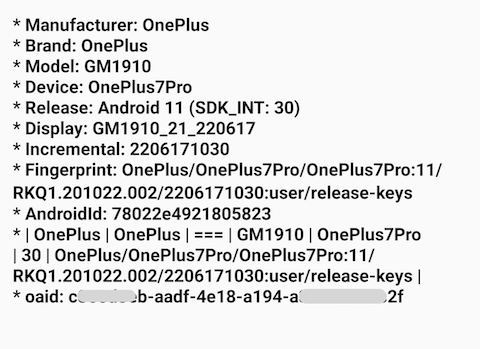

Identifier
=========

[](https://jitpack.io/#phantomVK/Identifier) [](https://github.com/phantomVK/SlideBack/blob/master/LICENSE)

[中文版README](./README_CN.md)


简介
-----------

安卓开放匿名设备标识符，[设备兼容性列表](./COMPATIBILITY_LIST.md)



下载
-----------
配置 __Gradle__ 的 __JitPack__ 下载依赖源。

```groovy
// build.gradle(Project)
allprojects {
    repositories {
        maven { url 'https://jitpack.io' }
    }
}

// build.gradle(:app)
dependencies {
    implementation "com.github.phantomVK:Identifier:latest.release@aar"
}
```

使用
-------

在app的 Application.class 初始化 IdentifierManager。本初始化逻辑不耗时，可以放心在主线程执行。

```kotlin
class Application : android.app.Application() {
  override fun onCreate() {
    super.onCreate()

    IdentifierManager.Builder(applicationContext)
      .setDebug(false)
      .setExperimental(false)
      .setMemCacheEnable(true)
      .setExecutor { Thread(it).start() } // 可选: 设置自定义ThreadPoolExecutor
      .setLogger(LoggerImpl())
      .init()
  }
}
```

如何获取标识符

```kotlin
val listener = object : OnResultListener {
  override fun onSuccess(result: IdentifierResult) {}
  override fun onError(msg: String, throwable: Throwable?) {}
}

IdentifierManager.build()
  .enableAsyncCallback(false) // 可选：在异步线程执行结果回调，默认为关闭
  .enableAaid(false)
  .enableVaid(false)
  .enableGoogleAdsId(false) // 可选: 使用GoogleAdsId作为备选，默认关闭
  .enableVerifyLimitAdTracking(false)
  .subscribe(listener)
```

许可证
--------

```
Copyright 2024 WenKang Tan(phantomVK)

Licensed under the Apache License, Version 2.0 (the "License");
you may not use this file except in compliance with the License.
You may obtain a copy of the License at

   http://www.apache.org/licenses/LICENSE-2.0

Unless required by applicable law or agreed to in writing, software
distributed under the License is distributed on an "AS IS" BASIS,
WITHOUT WARRANTIES OR CONDITIONS OF ANY KIND, either express or implied.
See the License for the specific language governing permissions and
limitations under the License.
```